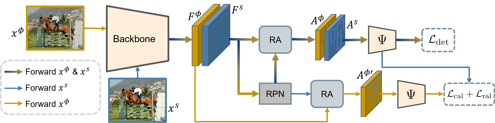
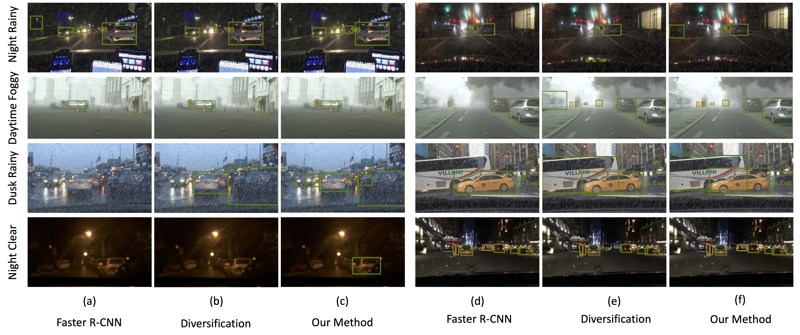

# Improving Single Domain-Generalized Object Detection: A Focus on Diversification and Alignment [CVPR-2024]
<p align="center">
    
</p>

#### [Muhammad Sohail Danish](https://www.linkedin.com/in/muhammad-sohail-danish/)<sup>1</sup>, [Muhammad Haris Khan](https://m-haris-khan.com/)<sup>1</sup>, [Muhammad Akhtar Munir](https://akhtarvision.github.io/)<sup>1,2</sup>, [M. Sarfraz](https://ssarfraz.github.io/)<sup>3,4</sup> and [Mohsen Ali](https://mohsenali.github.io/)<sup>2</sup>

#### **<sup>1</sup>Mohamed bin Zayed University of AI, <sup>2</sup>Information Technology University of Punjab, <sup>3</sup>Mercedes-Benz Tech Innovation, <sup>4</sup>Karlsruhe Institute of Technology**

[](https://arxiv.org/abs/2405.14497)
[](https://mbzuaiac-my.sharepoint.com/:f:/g/personal/muhammad_sohail_mbzuai_ac_ae/Ei-vfphu1RVOs0Zkle8vSD8Bub6XxaPxBnwEY2j5uWCVbQ?e=cjbFIU)

---

## 📢 Latest Updates

- **Jun-10-24**: DivAlign paper is released [arxiv link](https://arxiv.org/abs/2405.14497). 🔥🔥
- **Feb-27-24**: DivAlign has been accepted to **CVPR-24** 🎉. 
---


## Overview
In this work, we tackle the problem of domain generalization for object detection, specifically focusing on the scenario where only a single source domain is available. We propose an effective approach that involves two key steps: diversifying the source domain and aligning detections based on class prediction confidence and localization. Firstly, we demonstrate that by carefully selecting a set of augmentations, a base detector can outperform existing methods for single domain generalization by a good margin. This highlights the importance of domain diversification in improving the performance of object detectors. Secondly, we introduce a method to align detections from multiple views, considering both classification and localization outputs. This alignment procedure leads to better generalized and well-calibrated object detector models, which are crucial for accurate decision-making in safety-critical applications. Our approach is detector-agnostic and can be seamlessly applied to both single-stage and two-stage detectors. To validate the effectiveness of our proposed methods, we conduct extensive experiments and ablations on challenging domain-shift scenarios. The results consistently demonstrate the superiority of our approach compared to existing methods. 

### Installation
Our code is based on [Mask R-CNN Benchmark](https://github.com/facebookresearch/maskrcnn-benchmark). \
Check [INSTALL.md](INSTALL.md) for installation instructions. 


### Datasets
Download [Diverse Weather](https://github.com/AmingWu/Single-DGOD) and [Cross-Domain](https://naoto0804.github.io/cross_domain_detection/) Datasets and place in the structure in a parent-folder as shown.

```
|-clipart
   |--VOC2007
      |---Annotations
      |---ImageSets
      |---JPEGImages
   |--VOC2012
      |---Annotations
      |---ImageSets
      |---JPEGImages
|-clipart
   |--Annotations
   |--ImageSets
   |--JPEGImages
|-comic
   |--Annotations
   |--ImageSets
   |--JPEGImages
|-daytime_clear
   |--VOC2007
      |---Annotations
      |---ImageSets
      |---JPEGImages
|--daytime_foggy
   |--VOC2007
      |---Annotations
      |---ImageSets
      |---JPEGImages
|---dusk_rainy
   |--VOC2007
      |---Annotations
      |---ImageSets
      |---JPEGImages
|---night_rainy
   |--VOC2007
      |---Annotations
      |---ImageSets
      |---JPEGImages
      
```

### Training
We train our models on a 8 GPUs.
```
CUDA_VISIBLE_DEVICES=0,1,2,3,4,5,6,7 python -m torch.distributed.launch --nproc_per_node=8 --master_port=$((RANDOM + 10000)) tools/train_net.py --config-file "configs/pascal_voc/e2e_faster_rcnn_R_101_C4_1x_8_gpu_voc.yaml"

    or 

CUDA_VISIBLE_DEVICES=0,1,2,3,4,5,6,7 python -m torch.distributed.launch --nproc_per_node=8 --master_port=$((RANDOM + 10000)) tools/train_net.py --config-file "configs/pascal_voc/e2e_faster_rcnn_R_101_C4_1x_8_gpu_dc.yaml"
```


---
## 👁️💬 Architecture

At the core is a baseline detector, Here a two-stage detector Faster-RCNN is depicted, comprising of backbone, region proposal network (RPN), and ROI alignment (RA). To improve the single domain generalization of the baseline detector, we propose to diversify the single source domain and also align the diversified views by minimizing losses at both classification and regression outputs.
<p align="center">
  
</p>

---


## 🔍 Quantitative Results
<div style="display: flex; flex-direction: row; align-items:flex-start; justify-content: center;">

<div style="width:40%; padding: 10px;">
	<p><em>Table: Performance comparison with baseline and possible ablations, mAP@0.5(%) reported. The model is trained on Pascal VOC and tested on Clipart1k, Watercolor2k, and Comic2k.</em></p>
	<table style="margin-left: auto;
		margin-right: auto;">
		<thead>
			<tr>
				<th>Method</th>
				<th>VOC</th>
				<th>Clipart</th>
				<th>Watercolor</th>
				<th>Comic</th>
			</tr>
		</thead>
		<tbody>
			<tr>
				<td>Faster R-CNN</td>
				<td style="text-align: center;">81.8</td>
				<td style="text-align: center;">25.7</td>
				<td style="text-align: center;">44.5</td>
				<td style="text-align: center;">18.9</td>
			</tr>
			<tr>
				<td>NP</td>
				<td style="text-align: center;">79.2</td>
				<td style="text-align: center;">35.4</td>
				<td style="text-align: center;">53.3</td>
				<td style="text-align: center;">28.9</td>
			</tr>
			<tr>
				<td>Diversification (div.)</td>
				<td style="text-align: center;">82.1</td>
				<td style="text-align: center;">34.2</td>
				<td style="text-align: center;">53.0</td>
				<td style="text-align: center;">24.2</td>
			</tr>
			<tr>
				<td>div. + L<sub>cal</sub></td>
				<td style="text-align: center;">82.1</td>
				<td style="text-align: center;">36.2</td>
				<td style="text-align: center;">53.9</td>
				<td style="text-align: center;">28.7</td>
			</tr>
			<tr>
				<td>div. +L<sub>ral</sub></td>
				<td style="text-align: center;">80.7</td>
				<td style="text-align: center;">35.0</td>
				<td style="text-align: center;">53.8</td>
				<td style="text-align: center;">28.7</td>
			</tr>
			<tr>
				<td>div. + L<sub>cal</sub> + L<sub>ral</sub> (Ours)</td>
				<td style="text-align: center;">80.1</td>
				<td style="text-align: center;"><strong>38.9</strong></td>
				<td style="text-align: center;"><strong>57.4</strong></td>
				<td style="text-align: center;"><strong>33.2</strong></td>
			</tr>
		</tbody>
	</table>
</div>

<div style="width:40%; padding: 10px;">
	<p><em>Table: Results, mAP@0.5(%) reported on a multi-weather scenario where the model is trained on Daytime Sunny (DS) and tested on Night-Clear (NC), Night-Rainy (NR), Dusk-Rainy (DR) and Daytime-Foggy (DF).</em></p>
	<table style="margin-left: auto;
		margin-right: auto;">
		<thead>
			<tr>
				<th>Method</th>
				<th>DS</th>
				<th>NC</th>
				<th>DR</th>
				<th>NR</th>
				<th>DF</th>
			</tr>
		</thead>
		<tbody>
			<tr>
				<td>Faster R-CNN</td>
				<td style="text-align: center;">51.8</td>
				<td style="text-align: center;">38.9</td>
				<td style="text-align: center;">30.0</td>
				<td style="text-align: center;">15.7</td>
				<td style="text-align: center;">33.1</td>
			</tr>
			<tr>
				<td>SW</td>
				<td style="text-align: center;">50.6</td>
				<td style="text-align: center;">33.4</td>
				<td style="text-align: center;">26.3</td>
				<td style="text-align: center;">13.7</td>
				<td style="text-align: center;">30.8</td>
			</tr>
			<tr>
				<td>IBN-Net</td>
				<td style="text-align: center;">49.7</td>
				<td style="text-align: center;">32.1</td>
				<td style="text-align: center;">26.1</td>
				<td style="text-align: center;">14.3</td>
				<td style="text-align: center;">29.6</td>
			</tr>
			<tr>
				<td>IterNorm</td>
				<td style="text-align: center;">43.9</td>
				<td style="text-align: center;">29.6</td>
				<td style="text-align: center;">22.8</td>
				<td style="text-align: center;">12.6</td>
				<td style="text-align: center;">28.4</td>
			</tr>
			<tr>
				<td>ISW</td>
				<td style="text-align: center;">51.3</td>
				<td style="text-align: center;">33.2</td>
				<td style="text-align: center;">25.9</td>
				<td style="text-align: center;">14.1</td>
				<td style="text-align: center;">31.8</td>
			</tr>
			<tr>
				<td>Wu et al.</td>
				<td style="text-align: center;"><strong>56.1</strong></td>
				<td style="text-align: center;">36.6</td>
				<td style="text-align: center;">28.2</td>
				<td style="text-align: center;">16.6</td>
				<td style="text-align: center;">33.5</td>
			</tr>
			<tr>
				<td>Vidit et al.</td>
				<td style="text-align: center;">51.3</td>
				<td style="text-align: center;">36.9</td>
				<td style="text-align: center;">32.3</td>
				<td style="text-align: center;">18.7</td>
				<td style="text-align: center;"><strong>38.5</strong></td>
			</tr>
			<tr>
				<td>Diversification</td>
				<td style="text-align: center;">50.6</td>
				<td style="text-align: center;">39.4</td>
				<td style="text-align: center;">37.0</td>
				<td style="text-align: center;">22.0</td>
				<td style="text-align: center;">35.6</td>
			</tr>
			<tr>
				<td>Ours</td>
				<td style="text-align: center;">52.8</td>
				<td style="text-align: center;"><strong>42.5</strong></td>
				<td style="text-align: center;"><strong>38.1</strong></td>
				<td style="text-align: center;"><strong>24.1</strong></td>
				<td style="text-align: center;">37.2</td>
			</tr>
		</tbody>
	</table>
</div>

</div>

<div style="display: flex; flex-direction: row; align-items:flex-start; justify-content: center;">

<div style="width:40%; padding: 10px;">
    <p><em>Comparison of calibration performance using D-ECE metric (%) on Real to artistic shifts and in urban scene detection.</em></p>
	<table style="margin-left: auto;
		margin-right: auto;">
        <thead>
            <tr>
                <th></th>
                <th colspan="3">Artistic Shifts</th>
                <th colspan="4">Urban Scene</th>
            </tr>
            <tr>
                <th>Method</th>
                <th>Clipart</th>
                <th>Watercolor</th>
                <th>Comic</th>
                <th>NR</th>
                <th>DR</th>
                <th>NC</th>
                <th>DF</th>
            </tr>
        </thead>
        <tbody>
            <tr>
                <td>Faster R-CNN</td>
                <td>11.9</td>
                <td>18.5</td>
                <td>15.4</td>
                <td>31.5</td>
                <td>29.3</td>
                <td>27.9</td>
                <td>25.8</td>
            </tr>
            <tr>
                <td>Diversification (div.)</td>
                <td>14.5</td>
                <td>21.4</td>
                <td>17.4</td>
                <td>33.0</td>
                <td>30.2</td>
                <td>28.9</td>
                <td>25.7</td>
            </tr>
            <tr>
                <td>Ours</td>
                <td><strong>10.7</strong></td>
                <td><strong>14.4</strong></td>
                <td><strong>14.3</strong></td>
                <td><strong>29.3</strong></td>
                <td><strong>24.9</strong></td>
                <td><strong>15.8</strong></td>
                <td><strong>20.6</strong></td>
            </tr>
        </tbody>
    </table>

</div>

<div style="width:40%; padding: 10px;">
    <p><em>Performance comparison with single-stage baseline, mAP@0.5(%) reported. The model is trained on Pascal VOC and tested on Clipart1k, Watercolor2k and Comic2k.</em></p>
	<table style="margin-left: auto;
		margin-right: auto;">
        <thead>
            <tr>
                <th>Method</th>
                <th>VOC</th>
                <th>Clipart</th>
                <th>Watercolor</th>
                <th>Comic</th>
            </tr>
        </thead>
        <tbody>
            <tr>
                <td>FCOS</td>
                <td>78.1</td>
                <td>24.4</td>
                <td>44.3</td>
                <td>15.4</td>
            </tr>
            <tr>
                <td>Diversification (div.)</td>
                <td>79.6</td>
                <td>31.7</td>
                <td>48.8</td>
                <td>25.2</td>
            </tr>
            <tr>
				<td>div. +L<sub>cal</sub></td>
                <td><strong>80.1</strong></td>
                <td>35.4</td>
                <td>52.6</td>
                <td>29.4</td>
            </tr>
            <tr>
				<td>div. +L<sub>ral</sub></td>
                <td>77.5</td>
                <td>29.8</td>
                <td>50.3</td>
                <td>24.0</td>
            </tr>
            <tr>
				<td>div. + L<sub>cal</sub> + L<sub>ral</sub> (Ours)</td>
                <td>77.5</td>
                <td><strong>37.4</strong></td>
                <td><strong>55.0</strong></td>
                <td><strong>31.2</strong></td>
            </tr>
        </tbody>
    </table>
</div>

</div>


## 📊 Qualitative Results

Qualitative results of baseline (Faster-RCNN), only diversifying domain, and our method.
<p align="center">
  
</p>
<p align="center">
  
</p>
---


## 📜 Citation
```bibtex
@inproceedings{danish2024improving,
  title={Improving Single Domain-Generalized Object Detection: A Focus on Diversification and Alignment},
  author={Danish, Muhammad Sohail and Khan, Muhammad Haris and Munir, Muhammad Akhtar and Sarfraz, M Saquib and Ali, Mohsen},
  booktitle={Proceedings of the IEEE/CVF Conference on Computer Vision and Pattern Recognition},
  pages={17732--17742},
  year={2024}
}
```
